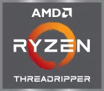

#  Mini ITX Build
 This build is an Intel Based Build due to the cooler temperatures of the Intel i9 processors vs. the latest AMD Ryzen or ThreadRippers.

[Plus I also liked the package :) ] 

| Part Type | Brand | Part | Description | Price | Site | URL |
|     :---      |     :---      |     :---      |     :---      |     :---      |     :---      |     :---      |
| Processor | AMD | AMD RYZEN 9 3900X 12-Core 3.8 GHz | Socket AM4 105W 100-100000023BOX  | $499.99 | B&H | https://www.bhphotovideo.com/c/product/1485447-REG/amd_100_100000023box_ryzen_9_3900x_3_8.html |
| Graphics | Gigabyte | GeForce RTX 2070 Super GAMING OC | 8GB 256-Bit GDDR6, GV-N207SGAMING OC-8GC  | $529.99 | Amazon | https://amzn.com/B07TV9CLL5 |
| Motherboard | MSI | B450I GAMING PLUS AC  |B450I GAMING PLUS AC AM4 Mini ITX - AMD B450 | $129.99 | NewEgg | https://www.newegg.com/msi-performance-gaming-b450i-gaming-plus-ac/p/N82E16813144190 
| Hard drive | WD | WD Black 500GB | M.2 SSD | $130.00 | NewEgg | https://www.newegg.com/Product/Product.aspx?Item=N82E16820250098 
| Power | Corsair | CORSAIR SF Series SF450 450W 80 PLUS |  | $85.00 | NewEgg | 
| Case | Streacom | DA2 |  Mini-Itx Case SKU: ST-DA2S [EAN: 8718469091270](https://streacom.com/products/da2-chassis/) | $239.00 | NewEgg  | https://www.newegg.com/p/2AM-005T-00028?item=9SIA5FY9B97666 https://www.youtube.com/watch?v=VHwJ9emNVQo (backup: Metallic Gear Neo Series MG-NE210G_BK01 or Louqe Ghost s1)
| Cooling | Asetek | Astek 5645LT | 92mm SFF AIO Liquid Cooler  | $100 | asetek | https://www.asetek.com/gaming/technology-for-gamingdiy/cpu-cooling/small-form-factor-cpu-cooler/ |
| Memory | G.Skill | TridentZ RGB Series 32GB DDR4-3200 |  | $179.99 | NewEgg |https://www.newegg.com/g-skill-32gb-288-pin-ddr4-sdram/p/N82E16820232748 |
| Case Fan | Noctua  | NF-A9 PWM  | 92x25mm A-series fan | $16.95 | Amazon  | https://amzn.com/B00RUZ059O |
|  |  |  | <b>Total</b> | $‭1,910.91‬ |  | |